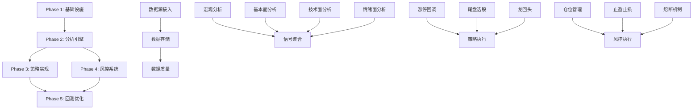

# 量化交易系统 - 任务开发文档 (TASK_FLOW)

**版本**: v1.0  
**日期**: 2026-04-19  
**关联PRD**: prd_quantitative_trading_system.md  

---

## 1. 任务总览

### 1.1 项目结构

```
xcnstock/
├── services/
│   ├── data_service/           # 数据服务层
│   │   ├── fetchers/           # 数据获取器
│   │   ├── processors/         # 数据处理器
│   │   └── storage/            # 数据存储
│   ├── analysis_service/       # 分析服务层 (新增)
│   │   ├── macro/              # 宏观分析
│   │   ├── fundamental/        # 基本面分析
│   │   ├── technical/          # 技术面分析
│   │   └── sentiment/          # 情绪面分析
│   ├── strategy_service/       # 策略服务层 (新增)
│   │   ├── limitup_callback/   # 涨停回调战法
│   │   ├── endstock_pick/      # 尾盘选股
│   │   └── dragon_head/        # 龙回头策略
│   ├── risk_service/           # 风控服务层 (新增)
│   │   ├── position/           # 仓位管理
│   │   ├── stoploss/           # 止盈止损
│   │   └── circuit_breaker/    # 熔断机制
│   └── backtest_service/       # 回测服务层 (新增)
│       └── engine/             # 回测引擎
├── core/                       # 核心模块
│   ├── models/                 # 数据模型
│   ├── indicators/             # 技术指标
│   └── utils/                  # 工具函数
├── scripts/                    # 脚本
│   ├── pipeline/               # 流水线脚本
│   └── tasks/                  # 定时任务
├── tests/                      # 测试
│   ├── unit/                   # 单元测试
│   ├── integration/            # 集成测试
│   └── e2e/                    # 端到端测试
└── docs/                       # 文档
```

### 1.2 任务依赖图



---

## 2. Phase 1: 基础设施 (Week 1-2)

### 2.1 任务分解

#### Task 1.1: 多源数据接入架构
**优先级**: P0  
**负责人**: 数据工程师  
**工时**: 3天  
**依赖**: 无  

**输入**:
- Tushare Pro API密钥
- BaoStock SDK
- AkShare库

**输出**:
- `services/data_service/datasource/manager.py` - 数据源管理器
- `services/data_service/datasource/providers.py` - 数据源提供者
- `services/data_service/datasource/failover.py` - 故障转移机制

**验收标准**:
```python
# 测试代码
def test_datasource_failover():
    manager = DataSourceManager()
    # 主源失效时自动切换到备源
    manager.simulate_primary_failure()
    assert manager.current_source == "akshare"
    
    # 恢复后切回主源
    manager.simulate_primary_recovery()
    assert manager.current_source == "tushare"
```

**子任务**:
- [ ] 1.1.1 设计数据源抽象接口 (0.5天)
- [ ] 1.1.2 实现Tushare提供者 (0.5天)
- [ ] 1.1.3 实现AkShare提供者 (0.5天)
- [ ] 1.1.4 实现BaoStock提供者 (0.5天)
- [ ] 1.1.5 实现故障转移逻辑 (0.5天)
- [ ] 1.1.6 健康检查与监控 (0.5天)

---

#### Task 1.2: 数据采集流水线
**优先级**: P0  
**负责人**: 数据工程师  
**工时**: 3天  
**依赖**: Task 1.1  

**输入**:
- 数据源管理器
- 股票列表

**输出**:
- `scripts/pipeline/data_collect_v2.py` - 增强版数据采集
- `services/data_service/processors/cleaner.py` - 数据清洗器
- `services/data_service/processors/adjuster.py` - 复权处理器

**验收标准**:
```python
def test_data_collection_pipeline():
    # 采集日线数据
    result = collect_kline_data(
        codes=['000001', '600000'],
        start_date='2024-01-01',
        end_date='2024-12-31',
        frequency='d'
    )
    assert len(result) == 2
    assert all(len(df) > 0 for df in result.values())
    
    # 验证数据完整性
    for code, df in result.items():
        assert 'open' in df.columns
        assert 'close' in df.columns
        assert 'high' in df.columns
        assert 'low' in df.columns
        assert 'volume' in df.columns
```

**子任务**:
- [ ] 1.2.1 实现K线数据采集 (1天)
- [ ] 1.2.2 实现财务数据采集 (0.5天)
- [ ] 1.2.3 实现估值数据采集 (0.5天)
- [ ] 1.2.4 实现宏观数据采集 (0.5天)
- [ ] 1.2.5 数据清洗与复权处理 (0.5天)

---

#### Task 1.3: 数据存储架构
**优先级**: P0  
**负责人**: 后端工程师  
**工时**: 2天  
**依赖**: Task 1.2  

**输入**:
- 清洗后的数据

**输出**:
- `services/data_service/storage/parquet_manager.py` - Parquet管理
- `services/data_service/storage/mysql_manager.py` - MySQL管理
- `services/data_service/storage/cache_manager.py` - 缓存管理

**验收标准**:
```python
def test_data_storage():
    # Parquet存储测试
    storage = ParquetStorage()
    storage.save_kline('000001', df)
    loaded = storage.load_kline('000001')
    assert loaded.equals(df)
    
    # MySQL存储测试
    mysql = MySQLStorage()
    mysql.save_daily_stats(stats)
    stats_loaded = mysql.load_daily_stats(date='2024-01-01')
    assert stats_loaded == stats
```

**子任务**:
- [ ] 1.3.1 设计存储抽象接口 (0.5天)
- [ ] 1.3.2 实现Parquet存储层 (0.5天)
- [ ] 1.3.3 实现MySQL存储层 (0.5天)
- [ ] 1.3.4 实现Redis缓存层 (0.5天)

---

#### Task 1.4: 数据质量监控
**优先级**: P1  
**负责人**: 数据工程师  
**工时**: 2天  
**依赖**: Task 1.3  

**输入**:
- 存储的数据

**输出**:
- `services/data_service/quality/validator.py` - 数据验证器
- `services/data_service/quality/monitor.py` - 质量监控
- `services/data_service/quality/alerts.py` - 告警系统

**验收标准**:
```python
def test_data_quality():
    validator = DataValidator()
    
    # 验证价格合理性
    assert validator.validate_price(df) == True
    
    # 验证成交量合理性
    assert validator.validate_volume(df) == True
    
    # 验证数据连续性
    assert validator.validate_continuity(df) == True
```

---

## 3. Phase 2: 分析引擎 (Week 3-4)

### 3.1 宏观分析模块

#### Task 2.1: 宏观数据获取与处理
**优先级**: P0  
**工时**: 2天  
**依赖**: Phase 1  

**输出**:
- `services/analysis_service/macro/data_collector.py`
- `services/analysis_service/macro/indicators.py`

**子任务**:
- [ ] 2.1.1 Shibor利率数据采集 (0.5天)
- [ ] 2.1.2 存贷款利率数据采集 (0.5天)
- [ ] 2.1.3 货币供应量数据采集 (0.5天)
- [ ] 2.1.4 宏观指标计算与存储 (0.5天)

#### Task 2.2: 宏观择时模型
**优先级**: P0  
**工时**: 2天  
**依赖**: Task 2.1  

**输出**:
- `services/analysis_service/macro/timing_model.py`
- `services/analysis_service/macro/signal_generator.py`

**算法逻辑**:
```python
class MacroTimingModel:
    def generate_signal(self, macro_data):
        # Shibor趋势判断
        shibor_trend = self.calculate_shibor_trend(macro_data['shibor'])
        
        # 流动性评分
        liquidity_score = self.calculate_liquidity_score(macro_data)
        
        # 生成择时信号
        if liquidity_score > 70 and shibor_trend == 'down':
            return Signal.BULLISH
        elif liquidity_score < 30 and shibor_trend == 'up':
            return Signal.BEARISH
        else:
            return Signal.NEUTRAL
```

---

### 3.2 基本面分析模块

#### Task 2.3: 财务数据筛选器
**优先级**: P0  
**工时**: 2天  
**依赖**: Phase 1  

**输出**:
- `services/analysis_service/fundamental/financial_screener.py`
- `services/analysis_service/fundamental/valuation_analyzer.py`

**筛选规则**:
```python
FUNDAMENTAL_RULES = {
    'roe_min': 10,              # ROE > 10%
    'gross_margin_min': 20,     # 毛利率 > 20%
    'profit_growth_min': 20,    # 净利润增长率 > 20%
    'pe_max': 50,               # PE < 50
    'pb_max': 10,               # PB < 10
}
```

#### Task 2.4: 财务风险预警
**优先级**: P1  
**工时**: 1天  
**依赖**: Task 2.3  

**输出**:
- `services/analysis_service/fundamental/risk_detector.py`

**风险指标**:
- 应收账款异常增长
- 存货周转率下降
- 现金流与利润背离
- 资产负债率过高

---

### 3.3 技术面分析模块

#### Task 2.5: 技术指标计算
**优先级**: P0  
**工时**: 2天  
**依赖**: Phase 1  

**输出**:
- `core/indicators/trend.py` - 趋势指标 (EMA/MACD)
- `core/indicators/momentum.py` - 动量指标 (RSI/KDJ)
- `core/indicators/volume.py` - 成交量指标

**指标列表**:
- EMA (5, 10, 20, 60, 120, 250)
- MACD (12, 26, 9)
- RSI (6, 12, 24)
- KDJ (9, 3, 3)
- BOLL (20, 2)

#### Task 2.6: K线形态识别
**优先级**: P0  
**工时**: 3天  
**依赖**: Task 2.5  

**输出**:
- `core/indicators/patterns.py` - 形态识别引擎

**形态库**:
```python
BULLISH_PATTERNS = [
    'morning_star',         # 早晨之星
    'three_white_soldiers', # 红三兵
    'bullish_engulfing',    # 看涨吞没
    'hammer',               # 锤子线
    'piercing_pattern',     # 刺透形态
    # ... 共103种
]

BEARISH_PATTERNS = [
    'evening_star',         # 黄昏之星
    'two_crows',            # 双飞乌鸦
    'bearish_engulfing',    # 看跌吞没
    'shooting_star',        # 射击之星
    'dark_cloud_cover',     # 乌云盖顶
    # ... 共9种逃顶形态
]
```

---

### 3.4 情绪面分析模块

#### Task 2.7: AI研报解析
**优先级**: P1  
**工时**: 2天  
**依赖**: Phase 1  

**输出**:
- `services/analysis_service/sentiment/deepseek_client.py`
- `services/analysis_service/sentiment/report_analyzer.py`

**功能**:
- 研报文本提取
- DeepSeek API调用
- 上涨概率测算
- 催化事件识别

#### Task 2.8: 新闻情绪分析
**优先级**: P1  
**工时**: 1天  
**依赖**: Task 2.7  

**输出**:
- `services/analysis_service/sentiment/news_analyzer.py`

---

## 4. Phase 3: 策略实现 (Week 5-6)

### 4.1 涨停回调战法

#### Task 3.1: 涨停回调策略引擎
**优先级**: P0  
**工时**: 3天  
**依赖**: Phase 2  

**输出**:
- `services/strategy_service/limitup_callback/strategy.py`
- `services/strategy_service/limitup_callback/filters.py`
- `services/strategy_service/limitup_callback/signals.py`

**策略逻辑**:
```python
class LimitupCallbackStrategy:
    def execute(self, stock_data):
        # Step 1: 初步筛选
        filtered = self.step1_filter(stock_data)
        
        # Step 2: 趋势确认
        confirmed = self.step2_confirm(filtered)
        
        # Step 3: 买入时机
        signals = self.step3_timing(confirmed)
        
        return signals
    
    def step1_filter(self, data):
        """筛除三连板以上、换手率>20%、业绩亏损股"""
        return data[
            (data['limitup_days'] <= 3) &
            (data['turnover'] <= 20) &
            (data['roe'] > 0)
        ]
    
    def step2_confirm(self, data):
        """确认月线MACD金叉且股价>60月线"""
        return data[
            (data['macd_monthly'] == 'golden_cross') &
            (data['close'] > data['ema_60_monthly'])
        ]
    
    def step3_timing(self, data):
        """回调至20日均线且放量阳线"""
        signals = []
        for stock in data:
            if (stock['close'] <= stock['ema_20'] * 1.02 and
                stock['close'] >= stock['ema_20'] * 0.98 and
                stock['volume'] > stock['volume_20_avg'] * 1.5 and
                stock['close'] > stock['open']):
                signals.append(BuySignal(stock))
        return signals
```

---

### 4.2 尾盘选股模型

#### Task 3.2: 尾盘选股引擎
**优先级**: P0  
**工时**: 2天  
**依赖**: Phase 2  

**输出**:
- `services/strategy_service/endstock_pick/strategy.py`

**筛选条件**:
```python
ENDSTOCK_CRITERIA = {
    'time': '14:30',           # 14:30后开始筛选
    'price_change_min': 3,     # 涨幅 > 3%
    'price_change_max': 5,     # 涨幅 < 5%
    'volume_ratio_min': 1,     # 量比 > 1
    'volume_ratio_max': 5,     # 量比 < 5
    'market_cap_min': 50,      # 市值 > 50亿
    'market_cap_max': 200,     # 市值 < 200亿
    'above_ma': True,          # 股价在分时均线之上
}
```

---

### 4.3 打板与龙回头

#### Task 3.3: 打板策略引擎
**优先级**: P1  
**工时**: 2天  
**依赖**: Phase 2  

**输出**:
- `services/strategy_service/dragon_head/strategy.py`

**功能**:
- 高度板识别
- 补涨板识别
- 领涨板分析
- 龙回头回踩检测

---

## 5. Phase 4: 风控系统 (Week 7)

### 5.1 仓位管理

#### Task 4.1: 凯利公式仓位计算
**优先级**: P0  
**工时**: 1天  
**依赖**: Phase 3  

**输出**:
- `services/risk_service/position/kelly_calculator.py`

**算法**:
```python
class KellyCalculator:
    def calculate(self, win_rate, win_loss_ratio):
        """
        凯利公式: f = (p*b - q) / b
        f: 最优仓位比例
        p: 胜率
        q: 败率 (1-p)
        b: 盈亏比
        """
        p = win_rate
        q = 1 - p
        b = win_loss_ratio
        
        kelly = (p * b - q) / b
        
        # 限制最大仓位
        return min(kelly * 0.5, 0.2)  # 半凯利，单票最多20%
```

#### Task 4.2: 利弗莫尔仓位管理
**优先级**: P0  
**工时**: 1天  
**依赖**: Task 4.1  

**输出**:
- `services/risk_service/position/livermore_manager.py`

**规则**:
- 20%底仓试水
- 每上涨10%加仓
- 最高价回落10%清仓

---

### 5.2 止盈止损

#### Task 4.3: 止盈止损引擎
**优先级**: P0  
**工时**: 1天  
**依赖**: Phase 3  

**输出**:
- `services/risk_service/stoploss/manager.py`

**规则**:
```python
STOPLOSS_RULES = {
    'stoploss': 'ema_20_down_3pct',  # 20日均线下3%
    'take_profit_1': {'gain': 10, 'action': 'reduce_half'},  # 盈利10%减仓一半
    'take_profit_2': {'gain': 20, 'action': 'close_all'},    # 盈利20%清仓
}
```

---

### 5.3 熔断机制

#### Task 4.4: 熔断系统
**优先级**: P0  
**工时**: 1天  
**依赖**: Phase 3  

**输出**:
- `services/risk_service/circuit_breaker/manager.py`

**熔断规则**:
```python
CIRCUIT_BREAKER_RULES = {
    'market_drop_2pct': {'action': 'pause_buy', 'duration': '1d'},
    'macd_death_cross': {'action': 'reduce_50pct', 'duration': 'until_golden_cross'},
    'limit_down': {'action': 'stop_loss', 'price': 'limit_down_price'},
}
```

---

## 6. Phase 5: 回测优化 (Week 8)

### 6.1 回测引擎

#### Task 5.1: Backtrader集成
**优先级**: P0  
**工时**: 2天  
**依赖**: Phase 4  

**输出**:
- `services/backtest_service/engine/backtrader_adapter.py`
- `services/backtest_service/engine/data_feeder.py`

#### Task 5.2: 策略回测框架
**优先级**: P0  
**工时**: 2天  
**依赖**: Task 5.1  

**输出**:
- `services/backtest_service/strategy_wrapper.py`
- `services/backtest_service/result_analyzer.py`

**指标计算**:
- 年化收益率
- 最大回撤
- Sharpe比率
- 胜率
- 盈亏比

#### Task 5.3: 参数优化
**优先级**: P1  
**工时**: 2天  
**依赖**: Task 5.2  

**输出**:
- `services/backtest_service/optimizer/grid_search.py`
- `services/backtest_service/optimizer/genetic_algorithm.py`

---

## 7. 测试计划

### 7.1 单元测试

| 模块 | 测试文件 | 覆盖率目标 |
|------|---------|-----------|
| 数据源 | `tests/unit/test_datasource.py` | 90% |
| 分析引擎 | `tests/unit/test_analysis.py` | 85% |
| 策略 | `tests/unit/test_strategy.py` | 85% |
| 风控 | `tests/unit/test_risk.py` | 90% |

### 7.2 集成测试

| 场景 | 测试文件 |
|------|---------|
| 数据采集流水线 | `tests/integration/test_data_pipeline.py` |
| 策略信号生成 | `tests/integration/test_strategy_signal.py` |
| 风控触发 | `tests/integration/test_risk_trigger.py` |

### 7.3 端到端测试

| 场景 | 测试文件 |
|------|---------|
| 涨停回调战法完整流程 | `tests/e2e/test_limitup_callback.py` |
| 尾盘选股完整流程 | `tests/e2e/test_endstock_pick.py` |
| 回测完整流程 | `tests/e2e/test_backtest.py` |

---

## 8. 部署计划

### 8.1 环境配置

```yaml
# docker-compose.yml
version: '3.8'
services:
  data_service:
    build: ./services/data_service
    environment:
      - TUSHARE_TOKEN=${TUSHARE_TOKEN}
      - MYSQL_URL=${MYSQL_URL}
    volumes:
      - ./data:/app/data
  
  analysis_service:
    build: ./services/analysis_service
    depends_on:
      - data_service
  
  strategy_service:
    build: ./services/strategy_service
    depends_on:
      - analysis_service
  
  risk_service:
    build: ./services/risk_service
    depends_on:
      - strategy_service
  
  mysql:
    image: mysql:5.7
    environment:
      - MYSQL_ROOT_PASSWORD=${MYSQL_PASSWORD}
  
  redis:
    image: redis:6-alpine
```

### 8.2 上线 checklist

- [ ] 所有单元测试通过
- [ ] 所有集成测试通过
- [ ] 代码审查完成
- [ ] 文档更新完成
- [ ] 监控告警配置完成
- [ ] 数据备份策略确认

---

## 9. 风险管理

### 9.1 技术风险

| 风险 | 概率 | 影响 | 缓解措施 |
|------|------|------|---------|
| 数据源API变更 | 中 | 高 | 抽象接口，快速适配 |
| 性能瓶颈 | 低 | 中 | 缓存+异步+水平扩展 |
| 模型过拟合 | 中 | 高 | 交叉验证+样本外测试 |

### 9.2 业务风险

| 风险 | 概率 | 影响 | 缓解措施 |
|------|------|------|---------|
| 策略失效 | 中 | 高 | 多策略组合+持续优化 |
| 市场极端行情 | 低 | 高 | 熔断机制+仓位控制 |

---

## 10. 附录

### 10.1 命名规范

- 服务名: `{功能}_service`
- 模块名: `snake_case`
- 类名: `PascalCase`
- 函数名: `snake_case`
- 常量: `UPPER_SNAKE_CASE`

### 10.2 代码规范

- 遵循PEP8
- 类型注解强制
- 文档字符串完整
- 单元测试覆盖

### 10.3 提交规范

```
[type]: [subject]

[body]

[footer]

type: feat|fix|docs|style|refactor|test|chore
```

---

**文档维护记录**

| 版本 | 日期 | 修改人 | 修改内容 |
|------|------|-------|---------|
| v1.0 | 2026-04-19 | AI Assistant | 初始版本 |
