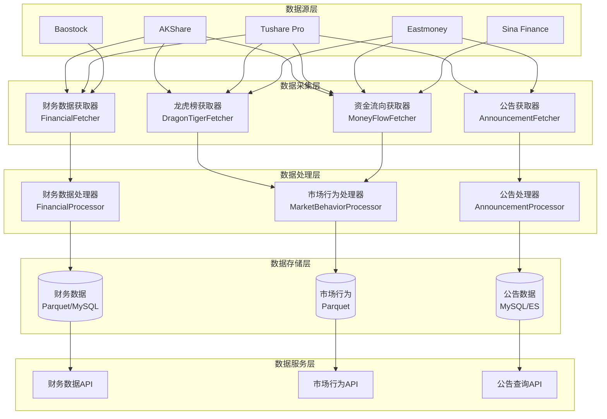
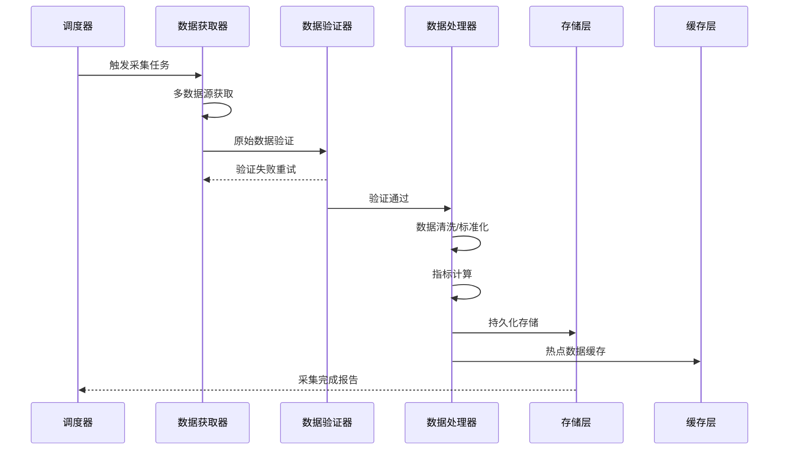

# 数据服务扩展设计文档

## 一、需求概述

### 1.1 当前状态
- ✅ 已实现：K线数据、估值指标(PE/PB/PS)、实时行情、指数数据
- ❌ 缺失：三大财务报表、龙虎榜、资金流向、公司公告

### 1.2 扩展目标
| 优先级 | 数据类型 | 业务价值 |
|--------|----------|----------|
| P0 | 财务数据(三大报表) | 基本面分析必需 |
| P0 | 市场行为数据(龙虎榜/资金流向) | 主力行为识别 |
| P0 | 公告系统(公司公告/重大事项) | 事件驱动分析 |

---

## 二、系统架构设计

### 2.1 整体架构图



### 2.2 数据流向图



---

## 三、财务数据模块设计

### 3.1 数据模型

#### 资产负债表 (Balance Sheet)
```yaml
balance_sheet:
  # 基本信息
  - code: str          # 股票代码
  - report_date: date  # 报告期
  - report_type: str   # 报告类型(年报/中报/季报)
  
  # 资产
  - total_assets: float           # 资产总计
  - current_assets: float         # 流动资产合计
  - cash_and_deposits: float      # 货币资金
  - trading_financial_assets: float  # 交易性金融资产
  - accounts_receivable: float    # 应收账款
  - inventory: float              # 存货
  - non_current_assets: float     # 非流动资产合计
  - fixed_assets: float           # 固定资产
  - intangible_assets: float      # 无形资产
  
  # 负债
  - total_liabilities: float      # 负债合计
  - current_liabilities: float    # 流动负债合计
  - short_term_loans: float       # 短期借款
  - accounts_payable: float       # 应付账款
  - non_current_liabilities: float # 非流动负债合计
  - long_term_loans: float        # 长期借款
  - bonds_payable: float          # 应付债券
  
  # 所有者权益
  - total_equity: float           # 所有者权益合计
  - share_capital: float          # 实收资本(股本)
  - capital_reserve: float        # 资本公积
  - surplus_reserve: float        # 盈余公积
  - retained_earnings: float      # 未分配利润
```

#### 利润表 (Income Statement)
```yaml
income_statement:
  # 基本信息
  - code: str
  - report_date: date
  - report_type: str
  
  # 营业收入
  - total_revenue: float          # 营业总收入
  - operating_revenue: float      # 营业收入
  - cost_of_revenue: float        # 营业成本
  
  # 期间费用
  - sales_expense: float          # 销售费用
  - admin_expense: float          # 管理费用
  - rd_expense: float             # 研发费用
  - financial_expense: float      # 财务费用
  
  # 利润
  - operating_profit: float       # 营业利润
  - total_profit: float           # 利润总额
  - net_profit: float             # 净利润
  - net_profit_parent: float      # 归母净利润
  - eps: float                    # 基本每股收益
  - diluted_eps: float            # 稀释每股收益
```

#### 现金流量表 (Cash Flow Statement)
```yaml
cash_flow_statement:
  # 基本信息
  - code: str
  - report_date: date
  - report_type: str
  
  # 经营活动
  - operating_cash_flow: float    # 经营活动现金流净额
  - cash_from_sales: float        # 销售商品收到的现金
  - cash_to_suppliers: float      # 购买商品支付的现金
  - cash_to_employees: float      # 支付给职工的现金
  
  # 投资活动
  - investing_cash_flow: float    # 投资活动现金流净额
  - cash_from_investments: float  # 收回投资收到的现金
  - cash_for_investments: float   # 投资支付的现金
  - cash_for_fixed_assets: float  # 购建固定资产支付的现金
  
  # 筹资活动
  - financing_cash_flow: float    # 筹资活动现金流净额
  - cash_from_borrowings: float   # 取得借款收到的现金
  - cash_repayment: float         # 偿还债务支付的现金
  - cash_dividends: float         # 分配股利支付的现金
  
  # 现金净变动
  - net_cash_increase: float      # 现金及等价物净增加额
  - beginning_cash: float         # 期初现金余额
  - ending_cash: float            # 期末现金余额
```

### 3.2 财务指标计算

```python
# 核心财务指标
financial_indicators = {
    # 盈利能力
    'roe': 'net_profit_parent / total_equity * 100',  # 净资产收益率
    'roa': 'net_profit / total_assets * 100',         # 总资产收益率
    'gross_margin': '(operating_revenue - cost_of_revenue) / operating_revenue * 100',
    'net_margin': 'net_profit / operating_revenue * 100',
    
    # 偿债能力
    'current_ratio': 'current_assets / current_liabilities',
    'quick_ratio': '(current_assets - inventory) / current_liabilities',
    'debt_to_asset': 'total_liabilities / total_assets * 100',
    'equity_ratio': 'total_equity / total_assets * 100',
    
    # 运营能力
    'inventory_turnover': 'cost_of_revenue / inventory',
    'receivable_turnover': 'operating_revenue / accounts_receivable',
    'asset_turnover': 'operating_revenue / total_assets',
    
    # 成长能力
    'revenue_growth': 'YoY(operating_revenue)',
    'profit_growth': 'YoY(net_profit_parent)',
    'asset_growth': 'YoY(total_assets)',
    
    # 现金流
    'ocf_to_profit': 'operating_cash_flow / net_profit',
    'free_cash_flow': 'operating_cash_flow - cash_for_fixed_assets',
}
```

### 3.3 存储设计

```
data/
├── financial/
│   ├── balance_sheet/          # 资产负债表
│   │   ├── 000001.parquet     # 按股票分片
│   │   └── ...
│   ├── income_statement/       # 利润表
│   │   ├── 000001.parquet
│   │   └── ...
│   ├── cash_flow/              # 现金流量表
│   │   ├── 000001.parquet
│   │   └── ...
│   └── indicators/             # 财务指标(派生数据)
│       ├── 000001.parquet
│       └── ...
```

### 3.4 API设计

```python
# 获取财务数据
GET /api/v1/financial/{code}/balance_sheet
GET /api/v1/financial/{code}/income_statement
GET /api/v1/financial/{code}/cash_flow

# 获取财务指标
GET /api/v1/financial/{code}/indicators

# 筛选接口
POST /api/v1/financial/screen
{
    "filters": {
        "roe": {"min": 15},
        "debt_to_asset": {"max": 60},
        "revenue_growth": {"min": 10}
    }
}
```

---

## 四、市场行为数据模块设计

### 4.1 龙虎榜数据 (Dragon Tiger List)

#### 数据模型
```yaml
dragon_tiger:
  # 基本信息
  - code: str              # 股票代码
  - trade_date: date       # 交易日期
  - reason: str            # 上榜原因(涨停/跌停/振幅等)
  
  # 交易数据
  - buy_amount: float      # 买入总额(万)
  - sell_amount: float     # 卖出总额(万)
  - net_amount: float      # 净额(万)
  - turnover_rate: float   # 换手率
  
  # 营业部明细(Top5)
  buy_details:             # 买入营业部
    - seat_name: str       # 营业部名称
    - amount: float        # 买入金额(万)
    - proportion: float    # 占比
      
  sell_details:            # 卖出营业部
    - seat_name: str
    - amount: float
    - proportion: float
```

#### 衍生指标
```python
dragon_tiger_indicators = {
    # 机构参与度
    'institution_buy_ratio': '机构买入金额 / 买入总额',
    'institution_sell_ratio': '机构卖出金额 / 卖出总额',
    'institution_net_ratio': '(机构买入 - 机构卖出) / 成交额',
    
    # 游资特征
    'hot_money_seats': '知名游资营业部出现次数',
    'hot_money_ratio': '游资金额 / 总成交额',
    
    # 持续性指标
    'consecutive_days': '连续上榜天数',
    'next_day_performance': '次日涨跌幅',
}
```

### 4.2 资金流向数据 (Money Flow)

#### 数据模型
```yaml
money_flow:
  # 基本信息
  - code: str              # 股票代码
  - trade_date: date       # 交易日期
  
  # 主力资金
  - main_inflow: float     # 主力流入(万)
  - main_outflow: float    # 主力流出(万)
  - main_net_flow: float   # 主力净流入(万)
  
  # 散户资金
  - retail_inflow: float   # 散户流入(万)
  - retail_outflow: float  # 散户流出(万)
  - retail_net_flow: float # 散户净流入(万)
  
  # 大单统计
  - large_buy: float       # 大单买入(万)
  - large_sell: float      # 大单卖出(万)
  - large_net: float       # 大单净额(万)
  
  # 占比指标
  - main_ratio: float      # 主力净流入占比
  - retail_ratio: float    # 散户净流入占比
  
  # 行业/概念资金流向(汇总)
  - sector_flow: dict      # 各行业资金流向
```

#### 资金流向分级
```python
# 按单量分级
order_levels = {
    'super_large': '>100万',    # 超大单
    'large': '20-100万',        # 大单
    'medium': '5-20万',         # 中单
    'small': '<5万',            # 小单
}

# 按方向分类
flow_directions = {
    'inflow': '主动买入',
    'outflow': '主动卖出',
    'passive_in': '被动买入',
    'passive_out': '被动卖出',
}
```

### 4.3 北向资金数据 (Northbound Flow)

```yaml
northbound_flow:
  - trade_date: date
  - code: str              # 股票代码(沪股通/深股通)
  - name: str              # 股票名称
  - shareholding: float    # 持股数量(万股)
  - market_value: float    # 持股市值(万)
  - net_buy: float         # 当日净买入(万股)
  - cumulative_net_buy: float  # 累计净买入
  - holding_ratio: float   # 持股比例
```

### 4.4 存储设计

```
data/
├── market_behavior/
│   ├── dragon_tiger/           # 龙虎榜数据
│   │   ├── 2024/
│   │   │   ├── 01.parquet     # 按月分片
│   │   │   └── ...
│   │   └── ...
│   ├── money_flow/             # 资金流向
│   │   ├── 000001.parquet     # 按股票分片
│   │   └── ...
│   ├── northbound/             # 北向资金
│   │   ├── sh.parquet         # 沪股通
│   │   └── sz.parquet         # 深股通
│   └── sector_flow/            # 行业资金流向
│       └── daily.parquet
```

### 4.5 API设计

```python
# 龙虎榜
GET /api/v1/market/dragon-tiger?date={date}&code={code}
GET /api/v1/market/dragon-tiger/stats?start={start}&end={end}

# 资金流向
GET /api/v1/market/money-flow/{code}?period={period}
GET /api/v1/market/money-flow/sector?sector={sector}

# 北向资金
GET /api/v1/market/northbound?code={code}&period={period}
GET /api/v1/market/northbound/top-holdings
```

---

## 五、公告系统模块设计

### 5.1 公告分类体系

```yaml
announcement_categories:
  # 定期报告
  periodic_reports:
    - annual_report          # 年度报告
    - semi_annual_report     # 半年度报告
    - quarterly_report       # 季度报告
    
  # 重大事项
  major_events:
    - asset_restructuring    # 资产重组
    - mna                    # 并购重组
    - equity_incentive       # 股权激励
    - private_placement      # 定向增发
    - rights_issue           # 配股
    - ipo                    # 首发上市
    
  # 经营相关
  operations:
    - contract_signing       # 重大合同
    - investment_decision    # 投资决策
    - production_suspension  # 停产公告
    - product_certification  # 产品认证
    
  # 股权变动
  equity_changes:
    - shareholding_change    # 持股变动
    - pledge_release         # 质押/解押
    - reduction_plan         # 减持计划
    - increase_plan          # 增持计划
    
  # 公司治理
  governance:
    - board_resolution       # 董事会决议
    - shareholders_meeting   # 股东大会
    - dividend_plan          # 分红方案
    - director_change        # 高管变动
    
  # 风险提示
  risk_warnings:
    - st_warning             # ST风险警示
    - delisting_risk         # 退市风险
    - suspension_notice      # 停牌公告
    - lawsuit                # 诉讼仲裁
```

### 5.2 数据模型

```yaml
announcement:
  # 基本信息
  - id: str                # 公告ID
  - code: str              # 股票代码
  - name: str              # 股票名称
  - title: str             # 公告标题
  - category: str          # 公告类别
  - sub_category: str      # 子类别
  
  # 时间信息
  - publish_date: datetime # 发布时间
  - trade_date: date       # 对应交易日
  
  # 内容信息
  - content: str           # 公告内容(全文)
  - content_url: str       # 原文链接
  - pdf_url: str           # PDF链接
  
  # 重要性
  - importance: int        # 重要性等级(1-5)
  - is_market_moving: bool # 是否影响股价
  
  # 处理状态
  - is_parsed: bool        # 是否已解析
  - parsed_data: dict      # 结构化数据
  - sentiment: float       # 情感得分(-1~1)
  
  # 元数据
  - source: str            # 来源(上交所/深交所)
  - created_at: datetime
  - updated_at: datetime
```

### 5.3 公告解析引擎

```python
# 关键信息提取
class AnnouncementParser:
    """公告内容解析器"""
    
    parsers = {
        'dividend_plan': DividendParser,      # 分红方案解析
        'equity_incentive': IncentiveParser,  # 股权激励解析
        'contract_signing': ContractParser,   # 合同解析
        'shareholding_change': HoldingParser, # 持股变动解析
        'asset_restructuring': MnaParser,     # 并购重组解析
    }
    
    def parse(self, announcement: dict) -> dict:
        """解析公告内容，提取结构化数据"""
        parser = self.parsers.get(announcement['category'])
        return parser.parse(announcement['content'])

# 情感分析
class SentimentAnalyzer:
    """公告情感分析器"""
    
    def analyze(self, content: str) -> dict:
        return {
            'score': float,           # 情感得分 -1~1
            'confidence': float,      # 置信度
            'keywords': list,         # 关键情感词
            'summary': str,           # 摘要
        }
```

### 5.4 事件驱动模型

```python
# 事件类型定义
event_types = {
    'earnings_surprise': {      # 业绩超预期
        'trigger': '净利润增长 > 30%',
        'impact_window': '3-5天',
    },
    'dividend_increase': {      # 分红提升
        'trigger': '分红率提升 > 20%',
        'impact_window': '公告前后',
    },
    'institutional_buying': {   # 机构增持
        'trigger': '机构净买入 > 5000万',
        'impact_window': '1-3天',
    },
    'contract_win': {           # 重大合同
        'trigger': '合同金额 > 年收入50%',
        'impact_window': '公告当天',
    },
    'restructuring': {          # 重组公告
        'trigger': '重大资产重组',
        'impact_window': '停牌至复牌',
    },
}
```

### 5.5 存储设计

```
data/
├── announcements/
│   ├── raw/                    # 原始公告文本
│   │   ├── 2024/
│   │   │   ├── 000001/
│   │   │   │   ├── 20240115_001.txt
│   │   │   │   └── ...
│   │   │   └── ...
│   │   └── ...
│   ├── structured/             # 结构化数据
│   │   └── announcements.parquet
│   ├── events/                 # 事件数据
│   │   └── events.parquet
│   └── index/                  # 索引(Elasticsearch)
└── mysql/
    └── announcements table     # 元数据存储
```

### 5.6 API设计

```python
# 公告查询
GET /api/v1/announcements?code={code}&category={cat}&start={start}&end={end}
GET /api/v1/announcements/{id}

# 事件查询
GET /api/v1/events?type={type}&impact={impact}

# 订阅管理
POST /api/v1/announcements/subscribe
{
    "codes": ["000001", "000002"],
    "categories": ["dividend_plan", "earnings_report"],
    "keywords": ["高送转", "业绩预增"]
}

# 实时推送(WebSocket)
WS /ws/announcements
```

---

## 六、数据采集策略

### 6.1 数据源分配

| 数据类型 | 主数据源 | 备用数据源 | 更新频率 |
|----------|----------|------------|----------|
| 财务报表 | Tushare Pro | AKShare | 季度(报告发布后) |
| 龙虎榜 | AKShare | Tushare Pro | 每日收盘后 |
| 资金流向 | AKShare | Eastmoney | 实时/日终 |
| 北向资金 | AKShare | Tushare Pro | 日终 |
| 公司公告 | AKShare | Tushare Pro | 实时推送 |

### 6.2 采集调度

```yaml
# 定时任务配置
cron_tasks:
  # 财务数据
  financial_reports:
    - name: "季度报告采集"
      schedule: "0 20 * 4,8,10 *"  # 季报季后每晚8点
      task: fetch_quarterly_reports
    
  # 市场行为数据
  market_behavior:
    - name: "龙虎榜采集"
      schedule: "30 15 * * 1-5"      # 交易日15:30
      task: fetch_dragon_tiger
    
    - name: "资金流向采集"
      schedule: "0 16 * * 1-5"       # 交易日16:00
      task: fetch_money_flow
    
    - name: "北向资金采集"
      schedule: "0 17 * * 1-5"       # 交易日17:00
      task: fetch_northbound
  
  # 公告数据
  announcements:
    - name: "公告实时采集"
      schedule: "*/5 9-17 * * 1-5"   # 交易日每5分钟
      task: fetch_announcements
```

### 6.3 数据质量保障

```python
# 财务数据验证规则
financial_validation_rules = {
    'balance_sheet': {
        'accounting_equation': 'assets == liabilities + equity',
        'non_negative': ['total_assets', 'total_equity'],
        'reasonable_range': {
            'debt_to_asset': (0, 100),
            'current_ratio': (0, 50),
        }
    },
    'income_statement': {
        'profit_logic': 'net_profit <= total_profit <= operating_profit',
        'eps_check': 'eps == net_profit_parent / total_shares',
    },
    'cash_flow': {
        'cash_reconciliation': 'ending_cash == beginning_cash + net_increase',
    }
}

# 龙虎榜验证
dragon_tiger_validation = {
    'amount_check': 'buy_amount + sell_amount == total_turnover',
    'proportion_check': 'sum(seat_proportions) <= 100',
}

# 公告验证
announcement_validation = {
    'required_fields': ['code', 'title', 'publish_date', 'content'],
    'date_range': 'publish_date <= now()',
    'content_length': 'len(content) > 100',
}
```

---

## 七、性能优化设计

### 7.1 存储优化

```python
# Parquet分区策略
partition_strategy = {
    'financial_data': {
        'partition_by': ['code', 'report_year'],
        'compression': 'zstd',
        'row_group_size': 10000,
    },
    'market_behavior': {
        'partition_by': ['trade_date'],
        'compression': 'snappy',
        'row_group_size': 50000,
    },
    'announcements': {
        'partition_by': ['publish_date'],
        'compression': 'zstd',
    }
}

# 索引策略
index_strategy = {
    'mysql': [
        'CREATE INDEX idx_code_date ON financial_data(code, report_date)',
        'CREATE INDEX idx_publish_date ON announcements(publish_date)',
        'CREATE FULLTEXT INDEX idx_content ON announcements(content)',
    ],
    'elasticsearch': {
        'announcements': {
            'mappings': {
                'title': {'type': 'text', 'analyzer': 'ik_max_word'},
                'content': {'type': 'text', 'analyzer': 'ik_max_word'},
                'category': {'type': 'keyword'},
                'publish_date': {'type': 'date'},
            }
        }
    }
}
```

### 7.2 缓存策略

```python
# Redis缓存配置
cache_config = {
    'financial_indicators': {
        'ttl': 3600,           # 1小时
        'key_pattern': 'financial:indicators:{code}',
    },
    'money_flow_realtime': {
        'ttl': 60,             # 1分钟
        'key_pattern': 'moneyflow:realtime:{code}',
    },
    'announcements_latest': {
        'ttl': 300,            # 5分钟
        'key_pattern': 'announcements:latest:{code}',
    },
    'dragon_tiger_hot': {
        'ttl': 1800,           # 30分钟
        'key_pattern': 'dragontiger:hot:{date}',
    },
}
```

---

## 八、接口汇总

### 8.1 财务数据API

| 接口 | 方法 | 说明 |
|------|------|------|
| /api/v1/financial/{code}/balance_sheet | GET | 资产负债表 |
| /api/v1/financial/{code}/income_statement | GET | 利润表 |
| /api/v1/financial/{code}/cash_flow | GET | 现金流量表 |
| /api/v1/financial/{code}/indicators | GET | 财务指标 |
| /api/v1/financial/screen | POST | 财务筛选 |

### 8.2 市场行为API

| 接口 | 方法 | 说明 |
|------|------|------|
| /api/v1/market/dragon-tiger | GET | 龙虎榜数据 |
| /api/v1/market/money-flow/{code} | GET | 个股资金流向 |
| /api/v1/market/money-flow/sector | GET | 行业资金流向 |
| /api/v1/market/northbound | GET | 北向资金 |

### 8.3 公告系统API

| 接口 | 方法 | 说明 |
|------|------|------|
| /api/v1/announcements | GET | 公告列表 |
| /api/v1/announcements/{id} | GET | 公告详情 |
| /api/v1/events | GET | 事件列表 |
| /api/v1/announcements/subscribe | POST | 订阅公告 |

---

## 九、实施路线图

### Phase 1: 财务数据 (2周)
- [ ] 资产负债表采集与存储
- [ ] 利润表采集与存储
- [ ] 现金流量表采集与存储
- [ ] 财务指标计算引擎
- [ ] 数据验证规则

### Phase 2: 市场行为数据 (2周)
- [ ] 龙虎榜数据采集
- [ ] 资金流向数据采集
- [ ] 北向资金数据采集
- [ ] 衍生指标计算

### Phase 3: 公告系统 (2周)
- [ ] 公告采集与存储
- [ ] 公告分类与解析
- [ ] 情感分析引擎
- [ ] 事件驱动模型
- [ ] 实时推送服务

### Phase 4: 集成与优化 (1周)
- [ ] API接口开发
- [ ] 性能优化
- [ ] 监控告警
- [ ] 文档完善

---

## 十、风险评估

| 风险点 | 影响 | 缓解措施 |
|--------|------|----------|
| 数据源不稳定 | 高 | 多数据源备份、降级策略 |
| 财务数据延迟 | 中 | 监控报告发布日历、主动重试 |
| 公告量过大 | 中 | 增量采集、重要性分级 |
| 存储成本增长 | 低 | Parquet压缩、冷热分离 |
