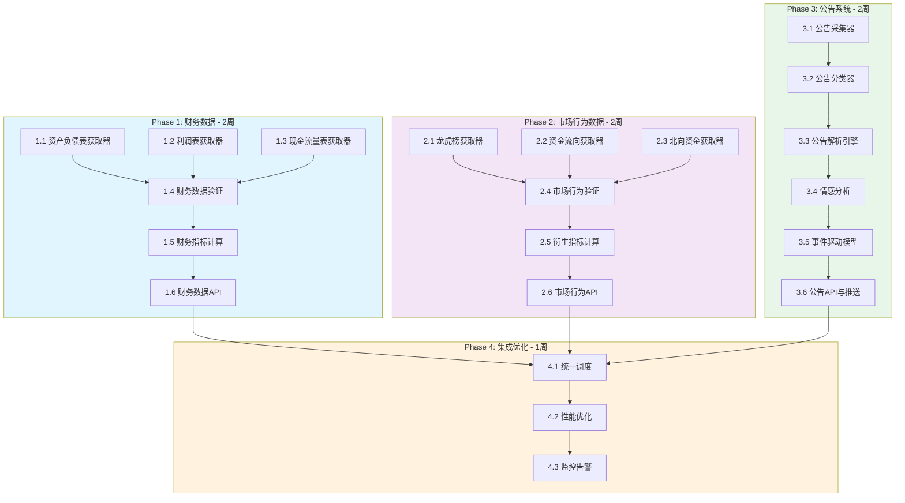

# 数据服务扩展 - 任务分解与执行计划

## 任务依赖图



---

## Phase 1: 财务数据模块

### 任务 1.1: 资产负债表获取器 (FinancialBalanceSheetFetcher)

**输入**: 股票代码、报告期
**输出**: 资产负债表Parquet文件

**实现步骤**:
1. 创建 `services/data_service/fetchers/financial/balance_sheet_fetcher.py`
2. 实现多数据源适配 (Tushare Pro / AKShare)
3. 定义数据模型与字段映射
4. 实现增量采集逻辑
5. 编写单元测试

**验收标准**:
- [ ] 可采集单只股票历史资产负债表
- [ ] 支持批量采集全市场数据
- [ ] 数据验证通过 (会计恒等式校验)
- [ ] 单元测试覆盖率 > 80%

**预估工时**: 2天

---

### 任务 1.2: 利润表获取器 (FinancialIncomeStatementFetcher)

**输入**: 股票代码、报告期
**输出**: 利润表Parquet文件

**实现步骤**:
1. 创建 `services/data_service/fetchers/financial/income_statement_fetcher.py`
2. 实现数据源适配
3. 处理非经常性损益项目
4. 实现EPS计算验证

**验收标准**:
- [ ] 利润表数据采集完整
- [ ] EPS计算与数据源一致
- [ ] 支持季度/年度数据
- [ ] 通过数据质量检查

**预估工时**: 2天

---

### 任务 1.3: 现金流量表获取器 (FinancialCashFlowFetcher)

**输入**: 股票代码、报告期
**输出**: 现金流量表Parquet文件

**实现步骤**:
1. 创建 `services/data_service/fetchers/financial/cash_flow_fetcher.py`
2. 实现三类现金流采集
3. 验证现金变动勾稽关系

**验收标准**:
- [ ] 三类现金流数据完整
- [ ] 现金净增加额校验通过
- [ ] 自由现金流计算正确

**预估工时**: 2天

---

### 任务 1.4: 财务数据验证器 (FinancialDataValidator)

**输入**: 财务数据DataFrame
**输出**: 验证报告

**实现步骤**:
1. 创建 `services/data_service/quality/financial_validator.py`
2. 实现会计恒等式验证
3. 实现财务指标合理性检查
4. 集成Great Expectations

**验证规则**:
```python
validation_rules = {
    'accounting_equation': 'assets == liabilities + equity',
    'profit_logic': 'net_profit <= total_profit',
    'cash_reconciliation': 'ending_cash == beginning_cash + net_increase',
    'ratio_range': {
        'debt_to_asset': (0, 100),
        'current_ratio': (0, 50),
    }
}
```

**预估工时**: 1.5天

---

### 任务 1.5: 财务指标计算引擎 (FinancialIndicatorEngine)

**输入**: 三大报表数据
**输出**: 财务指标Parquet文件

**实现步骤**:
1. 创建 `services/data_service/processors/financial/indicator_engine.py`
2. 实现盈利能力指标 (ROE/ROA/毛利率)
3. 实现偿债能力指标 (流动比率/资产负债率)
4. 实现运营能力指标 (周转率)
5. 实现成长能力指标 (同比增长)
6. 实现现金流指标

**指标清单**:
| 类别 | 指标 | 公式 |
|------|------|------|
| 盈利能力 | ROE | 归母净利润/净资产 |
| 盈利能力 | ROA | 净利润/总资产 |
| 盈利能力 | 毛利率 | (营收-成本)/营收 |
| 偿债能力 | 流动比率 | 流动资产/流动负债 |
| 偿债能力 | 资产负债率 | 总负债/总资产 |
| 运营能力 | 存货周转率 | 营业成本/存货 |
| 成长能力 | 营收增长率 | YoY(营业收入) |
| 现金流 | 经营现金流/净利润 | OCF/净利润 |

**预估工时**: 2天

---

### 任务 1.6: 财务数据API (FinancialDataAPI)

**输入**: HTTP请求
**输出**: JSON响应

**实现步骤**:
1. 创建 `services/data_service/api/financial_routes.py`
2. 实现报表查询接口
3. 实现指标查询接口
4. 实现财务筛选接口
5. 添加缓存层

**接口清单**:
```python
GET /api/v1/financial/{code}/balance_sheet
GET /api/v1/financial/{code}/income_statement
GET /api/v1/financial/{code}/cash_flow
GET /api/v1/financial/{code}/indicators
POST /api/v1/financial/screen
```

**预估工时**: 1.5天

---

## Phase 2: 市场行为数据模块

### 任务 2.1: 龙虎榜获取器 (DragonTigerFetcher)

**输入**: 交易日期
**输出**: 龙虎榜Parquet文件

**实现步骤**:
1. 创建 `services/data_service/fetchers/market_behavior/dragon_tiger_fetcher.py`
2. 实现AKShare数据源适配
3. 解析营业部买卖明细
4. 识别机构席位与游资席位
5. 实现历史数据补采

**数据结构**:
```python
{
    'code': str,
    'trade_date': date,
    'reason': str,
    'buy_amount': float,
    'sell_amount': float,
    'net_amount': float,
    'buy_details': [{'seat_name': str, 'amount': float}],
    'sell_details': [{'seat_name': str, 'amount': float}],
}
```

**验收标准**:
- [ ] 可获取当日龙虎榜完整数据
- [ ] 营业部明细解析正确
- [ ] 机构/游资标识准确
- [ ] 支持历史数据回溯

**预估工时**: 2天

---

### 任务 2.2: 资金流向获取器 (MoneyFlowFetcher)

**输入**: 股票代码/交易日期
**输出**: 资金流向Parquet文件

**实现步骤**:
1. 创建 `services/data_service/fetchers/market_behavior/money_flow_fetcher.py`
2. 实现主力/散户资金流向采集
3. 实现大单分级统计
4. 实现行业资金流向汇总

**数据分级**:
```python
order_levels = {
    'super_large': '>100万',    # 超大单
    'large': '20-100万',        # 大单
    'medium': '5-20万',         # 中单
    'small': '<5万',            # 小单
}
```

**预估工时**: 2天

---

### 任务 2.3: 北向资金获取器 (NorthboundFetcher)

**输入**: 交易日期
**输出**: 北向资金Parquet文件

**实现步骤**:
1. 创建 `services/data_service/fetchers/market_behavior/northbound_fetcher.py`
2. 实现沪股通/深股通数据采集
3. 计算持股比例变化
4. 实现Top持仓统计

**预估工时**: 1.5天

---

### 任务 2.4: 市场行为数据验证器

**输入**: 市场行为数据
**输出**: 验证报告

**验证规则**:
```python
validation_rules = {
    'dragon_tiger': {
        'amount_check': 'buy_amount + sell_amount == total_turnover',
        'proportion_check': 'sum(seat_proportions) <= 100',
    },
    'money_flow': {
        'conservation': 'main_flow + retail_flow == 0',
        'level_sum': 'sum(all_levels) == total_turnover',
    }
}
```

**预估工时**: 1天

---

### 任务 2.5: 市场行为衍生指标计算

**输入**: 原始市场行为数据
**输出**: 衍生指标数据

**指标清单**:
| 指标 | 说明 |
|------|------|
| 机构参与度 | 机构买卖金额占比 |
| 游资活跃度 | 知名游资出现频率 |
| 主力连续流入天数 | 主力资金净流入持续天数 |
| 资金流向强度 | 净流入/成交额 |
| 北向资金占比 | 北向持股/流通股本 |

**预估工时**: 1.5天

---

### 任务 2.6: 市场行为API

**接口清单**:
```python
GET /api/v1/market/dragon-tiger?date={date}
GET /api/v1/market/dragon-tiger/{code}/history
GET /api/v1/market/money-flow/{code}?period={period}
GET /api/v1/market/money-flow/sector/{sector}
GET /api/v1/market/northbound/top-holdings
GET /api/v1/market/northbound/{code}/history
```

**预估工时**: 1.5天

---

## Phase 3: 公告系统模块

### 任务 3.1: 公告采集器 (AnnouncementFetcher)

**输入**: 股票代码/时间范围
**输出**: 原始公告数据

**实现步骤**:
1. 创建 `services/data_service/fetchers/announcement/announcement_fetcher.py`
2. 实现AKShare公告接口适配
3. 实现上交所/深交所公告采集
4. 实现PDF原文下载
5. 实现增量采集机制

**数据源**:
- AKShare: 综合公告接口
- 上交所: 公告原文
- 深交所: 公告原文

**预估工时**: 2天

---

### 任务 3.2: 公告分类器 (AnnouncementClassifier)

**输入**: 公告标题+内容摘要
**输出**: 公告类别

**分类体系**:
```python
categories = {
    'periodic_reports': ['年度报告', '半年度报告', '季度报告'],
    'major_events': ['资产重组', '并购重组', '股权激励'],
    'equity_changes': ['持股变动', '质押', '减持'],
    'governance': ['董事会决议', '分红', '高管变动'],
    'risk_warnings': ['ST风险', '退市风险', '停牌'],
}
```

**实现方式**:
- 关键词匹配 (规则引擎)
- 机器学习分类 (可选优化)

**预估工时**: 1.5天

---

### 任务 3.3: 公告解析引擎 (AnnouncementParser)

**输入**: 公告全文
**输出**: 结构化数据

**解析器清单**:
| 公告类型 | 解析器 | 提取字段 |
|----------|--------|----------|
| 分红方案 | DividendParser | 分红比例、股权登记日 |
| 业绩预告 | EarningsPreviewParser | 预增/预减幅度 |
| 持股变动 | ShareholdingParser | 变动数量、变动后比例 |
| 重大合同 | ContractParser | 合同金额、履行期限 |
| 股权激励 | IncentiveParser | 授予数量、行权价格 |

**预估工时**: 2天

---

### 任务 3.4: 情感分析引擎 (SentimentAnalyzer)

**输入**: 公告内容
**输出**: 情感得分与摘要

**实现步骤**:
1. 集成DeepSeek/其他NLP服务
2. 构建财经领域情感词典
3. 实现公告摘要生成
4. 情感得分标准化 (-1~1)

**输出格式**:
```python
{
    'sentiment_score': float,     # -1~1
    'confidence': float,          # 0~1
    'summary': str,               # 摘要
    'keywords': list,             # 关键词
    'is_market_moving': bool,     # 是否影响股价
}
```

**预估工时**: 2天

---

### 任务 3.5: 事件驱动模型 (EventDrivenModel)

**输入**: 解析后的公告数据
**输出**: 投资事件信号

**事件类型定义**:
```python
event_types = {
    'earnings_surprise': {
        'trigger': '净利润增长 > 30%',
        'impact_window': '3-5天',
        'signal': 'positive',
    },
    'dividend_increase': {
        'trigger': '分红率提升 > 20%',
        'impact_window': '公告前后',
        'signal': 'positive',
    },
    'institutional_buying': {
        'trigger': '机构净买入 > 5000万',
        'impact_window': '1-3天',
        'signal': 'positive',
    },
}
```

**预估工时**: 1.5天

---

### 任务 3.6: 公告API与推送服务

**接口清单**:
```python
GET /api/v1/announcements?code={code}&category={cat}
GET /api/v1/announcements/{id}
GET /api/v1/events?type={type}
POST /api/v1/announcements/subscribe
WS /ws/announcements          # WebSocket实时推送
```

**推送规则**:
- 重要性等级 >= 4 的公告实时推送
- 用户订阅的股票公告实时推送
- 市场重大影响事件实时推送

**预估工时**: 2天

---

## Phase 4: 集成与优化

### 任务 4.1: 统一调度配置

**实现步骤**:
1. 更新 `config/cron_tasks.yaml`
2. 配置财务数据采集任务
3. 配置市场行为数据采集任务
4. 配置公告采集任务
5. 实现任务依赖管理

**调度配置**:
```yaml
cron_tasks:
  financial:
    - name: quarterly_reports
      schedule: "0 20 * 4,8,10 *"
  market_behavior:
    - name: dragon_tiger
      schedule: "30 15 * * 1-5"
    - name: money_flow
      schedule: "0 16 * * 1-5"
  announcements:
    - name: announcement_fetch
      schedule: "*/5 9-17 * * 1-5"
```

**预估工时**: 1天

---

### 任务 4.2: 性能优化

**优化项**:
1. Parquet分区优化
2. Redis缓存配置
3. 数据库索引优化
4. Elasticsearch索引配置
5. 批量插入优化

**预估工时**: 1.5天

---

### 任务 4.3: 监控告警

**监控指标**:
- 数据采集成功率
- 数据质量检查通过率
- API响应时间
- 存储容量使用率

**告警规则**:
- 采集失败 > 3次触发告警
- 数据质量检查失败率 > 5%触发告警
- API响应时间 > 2s触发告警

**预估工时**: 1天

---

## 任务清单汇总

| 任务ID | 任务名称 | 所属Phase | 预估工时 | 依赖任务 |
|--------|----------|-----------|----------|----------|
| 1.1 | 资产负债表获取器 | Phase 1 | 2天 | - |
| 1.2 | 利润表获取器 | Phase 1 | 2天 | - |
| 1.3 | 现金流量表获取器 | Phase 1 | 2天 | - |
| 1.4 | 财务数据验证器 | Phase 1 | 1.5天 | 1.1-1.3 |
| 1.5 | 财务指标计算引擎 | Phase 1 | 2天 | 1.4 |
| 1.6 | 财务数据API | Phase 1 | 1.5天 | 1.5 |
| 2.1 | 龙虎榜获取器 | Phase 2 | 2天 | - |
| 2.2 | 资金流向获取器 | Phase 2 | 2天 | - |
| 2.3 | 北向资金获取器 | Phase 2 | 1.5天 | - |
| 2.4 | 市场行为验证器 | Phase 2 | 1天 | 2.1-2.3 |
| 2.5 | 衍生指标计算 | Phase 2 | 1.5天 | 2.4 |
| 2.6 | 市场行为API | Phase 2 | 1.5天 | 2.5 |
| 3.1 | 公告采集器 | Phase 3 | 2天 | - |
| 3.2 | 公告分类器 | Phase 3 | 1.5天 | 3.1 |
| 3.3 | 公告解析引擎 | Phase 3 | 2天 | 3.2 |
| 3.4 | 情感分析引擎 | Phase 3 | 2天 | 3.3 |
| 3.5 | 事件驱动模型 | Phase 3 | 1.5天 | 3.4 |
| 3.6 | 公告API与推送 | Phase 3 | 2天 | 3.5 |
| 4.1 | 统一调度配置 | Phase 4 | 1天 | 1.6, 2.6, 3.6 |
| 4.2 | 性能优化 | Phase 4 | 1.5天 | 4.1 |
| 4.3 | 监控告警 | Phase 4 | 1天 | 4.2 |

**总计**: 约7周 (含缓冲时间)

---

## 执行建议

### 并行执行策略
1. **Phase 1 & Phase 2 可部分并行**: 
   - 任务1.1-1.3 (财务获取器) 与 任务2.1-2.3 (市场行为获取器) 可同时进行
   
2. **Phase 3 独立进行**: 公告系统相对独立，可在Phase 2后期启动

3. **Phase 4 收尾**: 所有模块完成后统一集成

### 优先级建议
```
P0 (立即开始):
- 1.1 资产负债表获取器
- 1.5 财务指标计算引擎 (ROE等核心指标)
- 2.1 龙虎榜获取器

P1 (第二周开始):
- 1.2, 1.3 其他财务报表
- 2.2 资金流向获取器
- 3.1 公告采集器

P2 (后续补充):
- 2.3 北向资金
- 3.4 情感分析
- 4.x 性能优化
```
