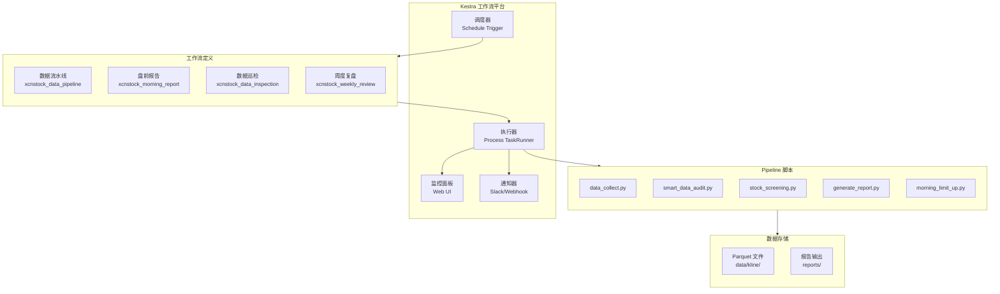
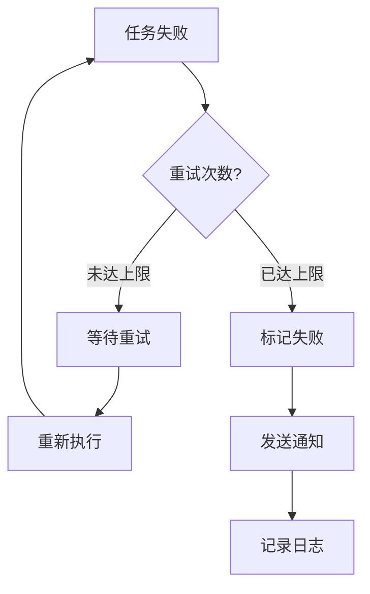

# Kestra 集成架构设计

## 架构概览



## 组件设计

### 1. 工作流定义层

| 工作流 ID | 用途 | 调度策略 | 超时 |
|-----------|------|----------|------|
| xcnstock_data_pipeline | 收盘后数据流水线 | 工作日 16:00 | 2H |
| xcnstock_morning_report | 盘前涨停板分析 | 工作日 09:26 | 10M |
| xcnstock_data_inspection | 数据质量巡检 | 每日 08:00 | 30M |
| xcnstock_weekly_review | 周度复盘报告 | 周日 20:00 | 1H |

### 2. 部署层

```mermaid
flowchart LR
    A[本地 YAML] -->|deploy.py| B[解析验证]
    B -->|PUT /api/v1/namespaces/{ns}/flows/{id}| C[Kestra API]
    C -->|部署结果| D[报告输出]
```

**部署脚本功能：**
- 批量部署所有工作流
- 部署前 YAML 语法验证
- 部署后自动验证
- 支持增量更新

### 3. 执行层

**任务类型选择：**
- 主要使用 `io.kestra.plugin.scripts.python.Script`
- TaskRunner: `io.kestra.plugin.core.runner.Process`
- 原因：直接执行本地 Python 脚本，无需 Docker 开销

**环境变量注入：**
```yaml
env:
  PYTHONPATH: "{{ vars.project_root }}"
  TUSHARE_TOKEN: "{{ secret('TUSHARE_TOKEN') }}"
  LOG_LEVEL: "{{ vars.log_level }}"
```

### 4. 监控层

**Kestra 原生监控：**
- 执行历史查询
- 实时日志查看
- 执行时长统计
- 失败率分析

**扩展监控（可选）：**
- 自定义 metrics 推送到 Prometheus
- Grafana 仪表盘

### 5. 通知层

**失败通知：**
```yaml
errors:
  - id: notify_on_failure
    type: io.kestra.plugin.notifications.slack.SlackExecution
    url: "{{ secret('SLACK_WEBHOOK_URL') }}"
```

**成功通知（可选）：**
- 关键任务完成后发送摘要

## API 契约

### Kestra API 调用

```python
# 部署工作流
PUT /api/v1/namespaces/{namespace}/flows/{flow_id}
Content-Type: application/x-yaml

# 触发执行
POST /api/v1/executions/{namespace}/{flow_id}
Content-Type: application/x-www-form-urlencoded

# 查询执行状态
GET /api/v1/executions/{execution_id}

# 获取日志
GET /api/v1/logs/{execution_id}
```

### 工作流 Inputs 规范

```yaml
inputs:
  - id: run_date
    type: STRING
    defaults: "{{ trigger.date }}"
    description: 执行日期 (YYYY-MM-DD)
  
  - id: stock_codes
    type: STRING
    required: false
    description: 指定股票代码 (逗号分隔)
  
  - id: skip_validation
    type: BOOLEAN
    defaults: false
    description: 跳过数据验证
```

## 错误处理策略

### 重试配置

```yaml
retry:
  type: exponential
  interval: PT2M
  maxAttempt: 3
  warningOnRetry: true
```

### 失败处理流程



## 安全设计

### 1. 密钥管理
- 敏感信息使用 Kestra Secrets
- 本地 `.env` 文件不提交到版本控制

### 2. 访问控制
- Kestra 使用基本认证 (Basic Auth)
- 生产环境建议启用 HTTPS

### 3. 输入验证
- 所有 inputs 进行类型检查
- 日期格式严格验证

## 性能考虑

### 1. 超时设置
- 数据收集: 1H
- 质检任务: 30M
- 选股评分: 20M
- 报告生成: 5M

### 2. 并发控制
- 默认单进程执行
- 数据收集阶段可并行（未来优化）

### 3. 资源限制
- 内存: 根据任务设置
- CPU: 不限制

## 部署架构

```
xcnstock/
├── kestra/
│   ├── flows/              # 工作流定义
│   │   ├── xcnstock_data_pipeline.yml
│   │   ├── xcnstock_morning_report.yml
│   │   └── ...
│   ├── deploy.py           # 部署脚本
│   ├── execute_flow.py     # 执行脚本
│   ├── monitor.py          # 监控脚本（新增）
│   └── lib/                # 共享库（新增）
│       ├── kestra_client.py
│       └── notifications.py
└── scripts/pipeline/       # Pipeline 脚本
    └── ...
```

## 下一步

进入任务拆解阶段，输出 `TASK_FLOW.md`
