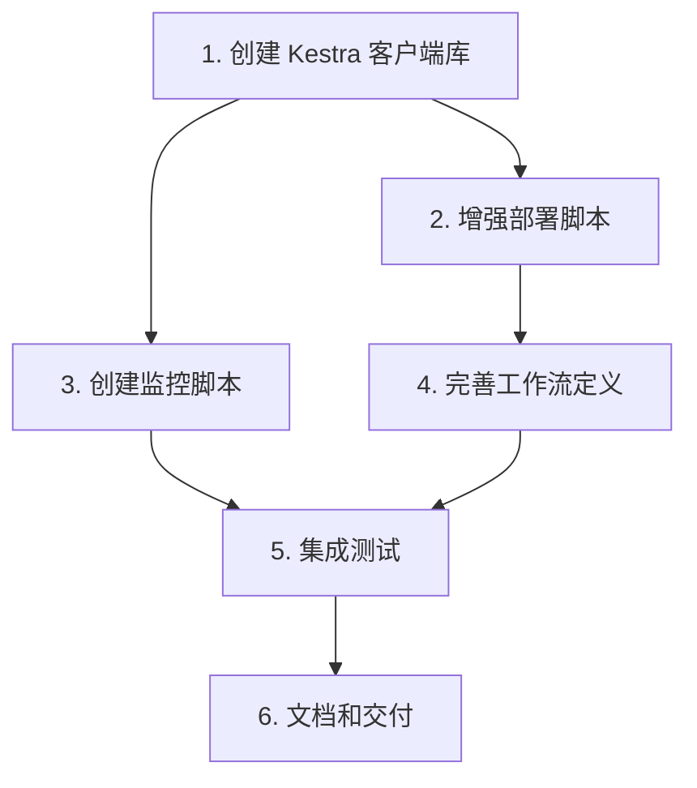

# Kestra 集成任务拆解

## 任务依赖图



## 任务清单

### Task 1: 创建 Kestra 客户端库
**优先级**: High
**预估耗时**: 2h

**输入**: 无
**输出**: `kestra/lib/kestra_client.py`

**验收标准**:
- [ ] 实现 Kestra API 封装（部署、执行、查询、日志）
- [ ] 支持认证和错误处理
- [ ] 包含单元测试

**实现要点**:
```python
class KestraClient:
    def deploy_flow(self, flow_file: Path) -> bool
    def execute_flow(self, namespace: str, flow_id: str, inputs: dict) -> str
    def get_execution(self, execution_id: str) -> dict
    def get_logs(self, execution_id: str) -> list
    def list_flows(self, namespace: str = None) -> list
```

---

### Task 2: 增强部署脚本
**优先级**: High
**预估耗时**: 1.5h
**依赖**: Task 1

**输入**: `kestra/deploy.py`
**输出**: 增强版 `kestra/deploy.py`

**验收标准**:
- [ ] 支持批量部署所有工作流
- [ ] 部署前 YAML 语法验证
- [ ] 部署后自动验证
- [ ] 生成部署报告

**实现要点**:
- 使用 `glob` 批量读取 `flows/*.yml`
- 使用 `pyyaml` 验证语法
- 部署后调用 `list_flows` 验证

---

### Task 3: 创建监控脚本
**优先级**: Medium
**预估耗时**: 1.5h
**依赖**: Task 1

**输入**: 无
**输出**: `kestra/monitor.py`

**验收标准**:
- [ ] 查看工作流列表
- [ ] 查看执行历史
- [ ] 实时查看执行日志
- [ ] 支持命令行参数

**实现要点**:
```bash
# 查看工作流列表
python kestra/monitor.py --list-flows

# 查看执行历史
python kestra/monitor.py --executions --flow xcnstock_data_pipeline

# 查看实时日志
python kestra/monitor.py --logs --execution <id> --follow
```

---

### Task 4: 完善工作流定义
**优先级**: High
**预估耗时**: 2h
**依赖**: Task 2

**输入**: `kestra/flows/*.yml`
**输出**: 完善的工作流定义

**验收标准**:
- [ ] 数据流水线工作流完整
- [ ] 盘前报告工作流完整
- [ ] 新增数据巡检工作流
- [ ] 所有工作流包含 inputs 定义
- [ ] 所有工作流配置重试策略

**工作流清单**:
1. `xcnstock_data_pipeline.yml` - 数据流水线（已有，完善）
2. `xcnstock_morning_report.yml` - 盘前报告（已有，完善）
3. `xcnstock_data_inspection.yml` - 数据巡检（新增）
4. `xcnstock_weekly_review.yml` - 周度复盘（新增）

---

### Task 5: 集成测试
**优先级**: High
**预估耗时**: 2h
**依赖**: Task 2, Task 3, Task 4

**输入**: 所有实现代码
**输出**: `tests/integration/test_kestra_integration.py`

**验收标准**:
- [ ] API 连接测试通过
- [ ] 部署测试通过
- [ ] 执行测试通过（使用测试工作流）
- [ ] 监控功能测试通过

**测试场景**:
1. 部署单个工作流
2. 批量部署所有工作流
3. 触发测试工作流执行
4. 查询执行状态
5. 获取执行日志

---

### Task 6: 文档和交付
**优先级**: Medium
**预估耗时**: 1h
**依赖**: Task 5

**输入**: 所有实现代码
**输出**: 完整文档

**验收标准**:
- [ ] 更新 `docs/kestra_integration/ACCEPTANCE.md`
- [ ] 编写使用指南
- [ ] 编写故障排查手册

---

## 执行计划

| 阶段 | 任务 | 状态 |
|------|------|------|
| 1 | Task 1: 创建 Kestra 客户端库 | ⏳ Pending |
| 2 | Task 2: 增强部署脚本 | ⏳ Pending |
| 3 | Task 3: 创建监控脚本 | ⏳ Pending |
| 4 | Task 4: 完善工作流定义 | ⏳ Pending |
| 5 | Task 5: 集成测试 | ⏳ Pending |
| 6 | Task 6: 文档和交付 | ⏳ Pending |

## 风险与应对

| 风险 | 影响 | 应对策略 |
|------|------|----------|
| Kestra API 变更 | 高 | 封装客户端，隔离变化 |
| 网络连接问题 | 中 | 增加重试机制 |
| 权限不足 | 中 | 提前验证认证信息 |
| 工作流语法错误 | 低 | 部署前 YAML 验证 |

## 确认指令

请回复 **"Proceed"** 确认进入自动化执行阶段。
