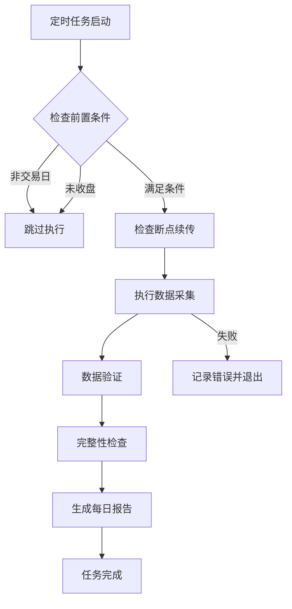

# 优化版定时任务服务说明

## 概述

优化版定时任务服务在原有基础上增加了以下功能：
1. **交易日判断**：只在交易日收盘后执行
2. **断点续传检查**：自动检测并恢复中断的采集任务
3. **数据验证**：采集完成后验证数据质量
4. **完整性检查**：确保当日数据采集完整
5. **详细报告**：生成每日采集报告

---

## 核心功能

### 1. 交易日判断

#### 功能说明
- 自动判断当前是否为交易日（周一至周五）
- 检查是否已收盘（16:00后）
- 非交易日或未收盘时自动跳过

#### 实现文件
- `scripts/trading_calendar.py` - 交易日判断工具

#### 使用示例
```python
from trading_calendar import check_market_status

status = check_market_status()
print(f"是否交易日: {status['is_trading_day']}")
print(f"是否收盘后: {status['is_after_market_close']}")
print(f"应执行任务: {status['should_run_task']}")
print(f"原因: {status['reason']}")
```

### 2. 断点续传检查

#### 功能说明
- 自动检测上次未完成的采集任务
- 判断断点文件是否有效（24小时内）
- 从断点位置继续采集，避免重复工作

#### 断点文件
- 位置：`data/kline/.fetch_progress.json`
- 内容：已处理的股票代码列表、时间戳等
- 有效期：24小时

#### 断点信息示例
```json
{
  "processed": ["000001", "000002", ...],
  "success": 4500,
  "failed": 10,
  "timestamp": "2026-03-24T16:30:00"
}
```

### 3. 数据验证

#### 功能说明
- 验证数据文件是否存在
- 检查必要字段是否完整
- 验证价格数据合理性（最高价≥最低价等）
- 检查数据排序和重复

#### 实现文件
- `scripts/data_validator.py` - 数据验证工具

#### 验证项目
- ✅ 文件存在性检查
- ✅ 必要字段检查（code, trade_date, open, close, high, low, volume）
- ✅ 价格合理性检查
- ✅ 日期排序检查
- ✅ 重复数据检查

#### 使用示例
```python
from data_validator import DataValidator

validator = DataValidator('data/kline')
result = validator.validate_stock_data('000001')

print(f"验证状态: {'有效' if result['valid'] else '无效'}")
print(f"错误: {result['errors']}")
print(f"警告: {result['warnings']}")
```

### 4. 完整性检查

#### 功能说明
- 检查所有股票是否包含上一交易日数据
- 统计数据完整率
- 列出缺失数据的股票

#### 检查逻辑
1. 获取上一个交易日
2. 检查每只股票是否包含该日期数据
3. 计算完整率
4. 生成缺失股票列表

#### 完整性报告示例
```
📊 数据完整性检查:
  ├─ 期望日期: 2026-03-24
  ├─ 总股票数: 5079
  ├─ 包含数据: 5070
  ├─ 缺失数据: 9
  └─ 完整率: 99.82%
```

### 5. 每日报告

#### 功能说明
- 生成JSON格式的每日报告
- 包含市场状态、验证结果、完整性检查
- 记录缺失数据的股票列表

#### 报告文件
- 位置：`logs/daily_report.json`
- 格式：JSON

#### 报告内容示例
```json
{
  "timestamp": "2026-03-24T17:30:00",
  "market_status": {
    "current_time": "2026-03-24 17:30:00",
    "weekday": "周一",
    "is_trading_day": true,
    "is_after_market_close": true,
    "should_run_task": true,
    "last_trading_day": "2026-03-24"
  },
  "validation": {
    "total": 5079,
    "valid": 5070,
    "invalid": 9,
    "warnings": 15
  },
  "completeness": {
    "expected_date": "2026-03-24",
    "total_stocks": 5079,
    "stocks_with_data": 5070,
    "stocks_missing_data": 9,
    "missing_stocks": ["000001", "000002", ...]
  }
}
```

---

## 执行流程

### 完整流程图



### 详细步骤

#### 1. 检查前置条件
```
✅ 检查是否为交易日（周一至周五）
✅ 检查是否已收盘（16:00后）
✅ 获取上一交易日
```

#### 2. 检查断点续传
```
✅ 检查断点文件是否存在
✅ 判断断点是否有效（24小时内）
✅ 决定是否从断点继续
```

#### 3. 执行数据采集
```
✅ 调用数据采集脚本
✅ 支持断点续传
✅ 记录采集进度
```

#### 4. 数据验证
```
✅ 验证所有股票数据
✅ 检查数据质量
✅ 统计验证结果
```

#### 5. 完整性检查
```
✅ 检查上一交易日数据
✅ 统计完整率
✅ 列出缺失股票
```

#### 6. 生成报告
```
✅ 生成JSON格式报告
✅ 记录详细信息
✅ 保存到日志目录
```

---

## 使用方法

### 方式一：Docker容器（推荐）

#### 1. 构建镜像
```bash
docker-compose -f docker-compose.cron.optimized.yml build
```

#### 2. 启动服务
```bash
docker-compose -f docker-compose.cron.optimized.yml up -d
```

#### 3. 查看日志
```bash
# 查看容器日志
docker-compose -f docker-compose.cron.optimized.yml logs -f

# 查看优化版日志
tail -f logs/scheduled_fetch_optimized.log

# 查看cron日志
tail -f logs/cron.log
```

#### 4. 查看报告
```bash
# 查看每日报告
cat logs/daily_report.json

# 或使用jq格式化
jq . logs/daily_report.json
```

### 方式二：直接运行脚本

#### 1. 手动执行
```bash
python scripts/scheduled_fetch_optimized.py
```

#### 2. 查看日志
```bash
tail -f logs/scheduled_fetch_optimized.log
```

---

## 配置说明

### 定时任务配置

编辑 `Dockerfile.cron.optimized` 中的cron配置：

```dockerfile
# 每工作日16:00执行
RUN echo "0 16 * * 1-5 cd /app && /usr/local/bin/python scripts/scheduled_fetch_optimized.py >> /app/logs/cron.log 2>&1" | crontab -
```

### 环境变量

在 `docker-compose.cron.optimized.yml` 中配置：

```yaml
environment:
  - TZ=Asia/Shanghai           # 时区
  - PYTHONUNBUFFERED=1         # Python输出不缓冲
```

---

## 日志文件

### 日志文件列表

| 文件名 | 说明 |
|--------|------|
| `logs/cron.log` | Cron定时任务日志 |
| `logs/scheduled_fetch_optimized.log` | 优化版脚本执行日志 |
| `logs/daily_report.json` | 每日采集报告 |
| `logs/scheduled_fetch.log` | 数据采集脚本日志 |

### 日志查看命令

```bash
# 查看所有日志
tail -f logs/*.log

# 查看优化版日志
tail -f logs/scheduled_fetch_optimized.log

# 查看cron日志
tail -f logs/cron.log

# 查看每日报告
cat logs/daily_report.json | jq .
```

---

## 故障排查

### 1. 任务未执行

#### 检查步骤
```bash
# 1. 查看容器状态
docker ps

# 2. 查看cron服务
docker exec -it xcnstock-cron-optimized service cron status

# 3. 查看日志
docker logs xcnstock-cron-optimized

# 4. 手动测试
docker exec -it xcnstock-cron-optimized python scripts/scheduled_fetch_optimized.py
```

### 2. 数据验证失败

#### 检查步骤
```bash
# 1. 查看验证日志
grep "验证" logs/scheduled_fetch_optimized.log

# 2. 查看无效数据
grep "无效" logs/scheduled_fetch_optimized.log

# 3. 手动验证单只股票
python -c "
from scripts.data_validator import DataValidator
validator = DataValidator('data/kline')
result = validator.validate_stock_data('000001')
print(result)
"
```

### 3. 完整性检查失败

#### 检查步骤
```bash
# 1. 查看完整性报告
cat logs/daily_report.json | jq '.completeness'

# 2. 查看缺失股票
cat logs/daily_report.json | jq '.completeness.missing_stocks'

# 3. 手动检查单只股票
python -c "
import pandas as pd
df = pd.read_parquet('data/kline/000001.parquet')
print(df['trade_date'].max())
"
```

---

## 性能优化

### 1. 并行验证

数据验证支持并行处理，可通过修改代码增加并发：

```python
from concurrent.futures import ThreadPoolExecutor

with ThreadPoolExecutor(max_workers=4) as executor:
    results = list(executor.map(validator.validate_stock_data, stock_list))
```

### 2. 缓存优化

交易日历支持缓存，减少重复计算：

```python
# 使用缓存
calendar = TradingCalendar()
is_trading = calendar.is_trading_day()  # 使用缓存
```

### 3. 增量验证

只验证新采集的数据，减少验证时间：

```python
# 只验证最近更新的股票
recent_stocks = get_recently_updated_stocks()
validation_results = validator.validate_all_stocks(recent_stocks)
```

---

## 最佳实践

### 1. 监控告警

建议配置以下监控：
- 容器运行状态
- 定时任务执行状态
- 数据完整率
- 验证失败数量

### 2. 日志轮转

配置日志轮转，避免磁盘占满：

```yaml
logging:
  driver: "json-file"
  options:
    max-size: "10m"
    max-file: "3"
```

### 3. 数据备份

定期备份重要数据：
- Parquet数据文件
- 每日报告
- 配置文件

### 4. 异常处理

建议配置异常通知：
- 邮件通知
- 钉钉/企业微信通知
- 短信通知

---

## 总结

优化版定时任务服务提供了完整的自动化数据采集流程：

✅ **智能判断**：只在交易日收盘后执行
✅ **断点续传**：自动恢复中断的任务
✅ **数据验证**：确保数据质量
✅ **完整性检查**：保证数据完整
✅ **详细报告**：记录执行详情

推荐使用优化版定时任务服务，确保数据采集的可靠性和完整性！
