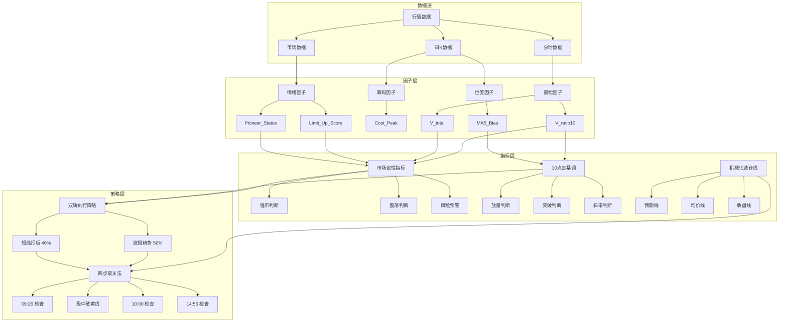

# 资金行为学量化系统实现计划

## 系统架构

## 实现步骤

### 1. 因子层实现
- **量能因子**：
  - `V_ratio10`：早盘09:30-10:00成交量与前一日同期比较
  - `V_total`：全市场实时总成交金额

- **筹码因子**：
  - `Cost_Peak`：筹码分布最大密集峰位

- **情绪因子**：
  - `Limit_Up_Score`：涨停家数 - 跌停家数 + 连板高度
  - `Pioneer_Status`：核心领涨股实时涨跌幅

- **位置因子**：
  - `MA5_Bias`：(当前价 - 5日均线) / 5日均线

### 2. 指标层实现
- **市场定性指标**：
  - 强市：V_total > 2.85万亿 且 情绪温度 > 50°
  - 震荡：2.5万亿 < V_total < 2.8万亿 且 筹码峰3882未跌破
  - 风险预警：Pioneer_Status < -5% 或 情绪温度 > 80°

- **10点定基调**：
  - 放量：V_ratio10 > 1.1
  - 突破：Price > 4081
  - 斜率：Trend_slope > 0
  - 三者同时满足触发"向上变盘"信号

- **机械化减仓线**：
  - 预期线：竞价是否封板
  - 均价线：Price < VWAP
  - 收盘线：14:56是否封板或翻绿

### 3. 策略层实现
- **双轨执行策略**：
  - 轨道一（50%仓位）：波段趋势
    - 选股：主线板块且MA5之上
    - 持有：Price > MA5且筹码峰3880守住
    - 止损：有效跌破MA5且3天内不收回
  
  - 轨道二（40%仓位）：短线打板/高频
    - 选股：情绪先锋、热点龙回头
    - 买入：10:00定基调向上后，个股放量突破
    - 卖出：四步取关法

- **四步取关法**：
  - 09:26：未封一字，撤1/4
  - 盘中：破黄线，撤1/4
  - 10:00：未涨停/炸板，撤1/4
  - 14:56：未封板，清仓

### 4. 系统集成
- 与现有因子系统集成
- 与策略引擎集成
- 与回测系统集成

### 5. 测试验证
- 因子计算测试
- 指标逻辑测试
- 策略回测
- 性能优化
