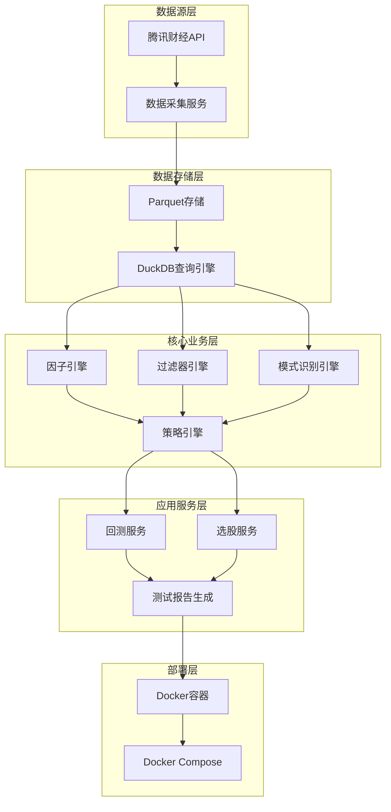

# 架构设计文档

## 系统架构

### 整体架构图



## 模块设计

### 1. 数据采集模块
- **功能**：从腾讯财经API采集A股历史K线数据
- **实现**：`scripts/fetch_history_klines_parquet.py`
- **存储**：`data/kline/`目录，每个股票一个Parquet文件
- **更新频率**：每日收盘后更新

### 2. 数据存储模块
- **格式**：Parquet - 高效列式存储
- **查询**：DuckDB - 嵌入式分析数据库
- **结构**：
  ```
  data/
  ├── kline/                    # K线数据目录
  │   ├── 000001.parquet       # 每个股票一个文件
  │   ├── 000002.parquet
  │   └── ...
  ├── stock_list.parquet       # 股票列表
  └── stock_list.csv           # 股票列表CSV格式
  ```

### 3. 因子引擎模块
- **功能**：计算各种技术指标和量价指标
- **实现**：`core/factor_engine.py` 和 `factors/`目录
- **因子类型**：
  - 技术指标：MA、MACD、KDJ、RSI等
  - 量价指标：MFI、OBV、成交量比率等

### 4. 过滤器引擎模块
- **功能**：根据各种条件过滤股票
- **实现**：`core/filter_engine.py` 和 `filters/`目录
- **过滤器类型**：
  - 基本面过滤器：违法违规、业绩等
  - 流动性过滤器：换手率、成交量等
  - 市场过滤器：市值、价格等
  - 技术过滤器：MA位置、MACD交叉等

### 5. 模式识别引擎模块
- **功能**：识别K线形态和趋势模式
- **实现**：`patterns/pattern_engine.py`
- **模式类型**：
  - K线形态：锤头、射击之星等
  - 趋势模式：突破、回调等

### 6. 策略引擎模块
- **功能**：基于因子、过滤器和模式识别结果执行选股策略
- **实现**：`core/strategy_engine.py`
- **策略类型**：
  - 多因子策略
  - 趋势跟随策略

### 7. 回测模块
- **功能**：验证策略效果
- **实现**：`core/backtest_engine.py`
- **参数**：回测时间范围、初始资金、交易成本等

### 8. 测试报告模块
- **功能**：生成测试报告，分析系统缺陷
- **实现**：`scripts/analyze_system_status.py`
- **报告内容**：测试结果、性能指标、缺陷统计、改进建议

## API设计

### 数据采集API
- **端点**：`/api/data/fetch`
- **方法**：POST
- **参数**：
  - `stock_codes`：股票代码列表
  - `start_date`：开始日期
  - `end_date`：结束日期
- **返回**：采集状态和数据量

### 因子计算API
- **端点**：`/api/factor/calculate`
- **方法**：POST
- **参数**：
  - `stock_codes`：股票代码列表
  - `factors`：因子名称列表
- **返回**：因子计算结果

### 选股API
- **端点**：`/api/strategy/select`
- **方法**：POST
- **参数**：
  - `strategy`：策略名称
  - `params`：策略参数
- **返回**：选股结果和评分

### 回测API
- **端点**：`/api/backtest/run`
- **方法**：POST
- **参数**：
  - `strategy`：策略名称
  - `start_date`：开始日期
  - `end_date`：结束日期
  - `initial_cash`：初始资金
- **返回**：回测结果和性能指标

## 数据库设计

### 股票列表表
| 字段名 | 数据类型 | 描述 |
| --- | --- | --- |
| code | VARCHAR(10) | 股票代码 |
| name | VARCHAR(50) | 股票名称 |
| market | VARCHAR(10) | 市场（沪市/深市） |
| list_date | DATE | 上市日期 |
| is_st | BOOLEAN | 是否ST |
| is_delisted | BOOLEAN | 是否已退市 |

### 回测结果表
| 字段名 | 数据类型 | 描述 |
| --- | --- | --- |
| id | INT | 主键 |
| strategy | VARCHAR(50) | 策略名称 |
| start_date | DATE | 开始日期 |
| end_date | DATE | 结束日期 |
| initial_cash | DECIMAL(18,2) | 初始资金 |
| final_cash | DECIMAL(18,2) | 最终资金 |
| total_return | DECIMAL(10,2) | 总收益率 |
| max_drawdown | DECIMAL(10,2) | 最大回撤 |
| sharpe_ratio | DECIMAL(10,2) | 夏普比率 |
| create_time | TIMESTAMP | 创建时间 |

### 选股结果表
| 字段名 | 数据类型 | 描述 |
| --- | --- | --- |
| id | INT | 主键 |
| strategy | VARCHAR(50) | 策略名称 |
| select_date | DATE | 选股日期 |
| stock_code | VARCHAR(10) | 股票代码 |
| stock_name | VARCHAR(50) | 股票名称 |
| score | DECIMAL(10,2) | 评分 |
| rank | INT | 排名 |
| create_time | TIMESTAMP | 创建时间 |

## 部署架构

### Docker Compose配置
```yaml
version: '3.8'
services:
  data-service:
    build: .
    command: python -m services.data_service.main
    volumes:
      - ./data:/app/data
    env_file:
      - .env

  stock-service:
    build: .
    command: python -m services.stock_service.main
    volumes:
      - ./data:/app/data
    env_file:
      - .env

  gateway:
    build: .
    command: python -m gateway.main
    ports:
      - "5000:5000"
    env_file:
      - .env

  mysql:
    image: mysql:5.7
    environment:
      MYSQL_ROOT_PASSWORD: root
      MYSQL_DATABASE: xcnstock
    volumes:
      - mysql-data:/var/lib/mysql

  redis:
    image: redis:6
    volumes:
      - redis-data:/data

volumes:
  mysql-data:
  redis-data:
```
