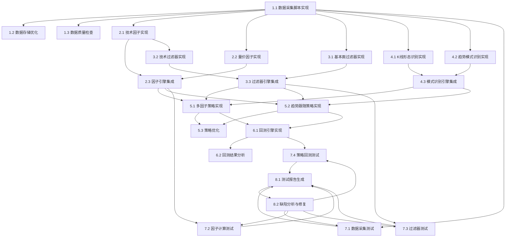

# 任务原子化文档

## 任务拆解

### 1. 数据采集模块

#### 1.1 数据采集脚本实现
- **功能**：从腾讯财经API采集A股历史K线数据
- **实现文件**：`scripts/fetch_history_klines_parquet.py`
- **依赖**：无
- **验证方法**：运行脚本，检查数据是否正确采集并存储为Parquet格式

#### 1.2 数据存储优化
- **功能**：优化Parquet存储结构，提高查询性能
- **实现文件**：`services/data_service/storage/parquet_manager.py`
- **依赖**：1.1
- **验证方法**：测试数据读写性能，确保满足每日更新需求

#### 1.3 数据质量检查
- **功能**：检查采集数据的完整性和准确性
- **实现文件**：`scripts/audit_data.py`
- **依赖**：1.1
- **验证方法**：运行检查脚本，确保数据无缺失和错误

### 2. 因子引擎模块

#### 2.1 技术因子实现
- **功能**：实现各种技术指标因子
- **实现文件**：`factors/technical/`目录下的各个因子文件
- **依赖**：1.1
- **验证方法**：测试因子计算结果的准确性

#### 2.2 量价因子实现
- **功能**：实现各种量价指标因子
- **实现文件**：`factors/volume_price/`目录下的各个因子文件
- **依赖**：1.1
- **验证方法**：测试因子计算结果的准确性

#### 2.3 因子引擎集成
- **功能**：集成所有因子，提供统一的计算接口
- **实现文件**：`core/factor_engine.py`
- **依赖**：2.1, 2.2
- **验证方法**：测试因子引擎的计算性能和准确性

### 3. 过滤器引擎模块

#### 3.1 基本面过滤器实现
- **功能**：实现基于基本面的过滤器
- **实现文件**：`filters/fundamental_filter.py`
- **依赖**：1.1
- **验证方法**：测试过滤器的过滤效果

#### 3.2 技术过滤器实现
- **功能**：实现基于技术指标的过滤器
- **实现文件**：`filters/technical_filter.py`
- **依赖**：2.1
- **验证方法**：测试过滤器的过滤效果

#### 3.3 过滤器引擎集成
- **功能**：集成所有过滤器，提供统一的过滤接口
- **实现文件**：`core/filter_engine.py`
- **依赖**：3.1, 3.2
- **验证方法**：测试过滤器引擎的过滤效果和性能

### 4. 模式识别引擎模块

#### 4.1 K线形态识别实现
- **功能**：实现K线形态识别
- **实现文件**：`patterns/candlestick.py`
- **依赖**：1.1
- **验证方法**：测试K线形态识别的准确性

#### 4.2 趋势模式识别实现
- **功能**：实现趋势模式识别
- **实现文件**：`patterns/continuation.py`和`patterns/reversal.py`
- **依赖**：1.1
- **验证方法**：测试趋势模式识别的准确性

#### 4.3 模式识别引擎集成
- **功能**：集成所有模式识别，提供统一的识别接口
- **实现文件**：`patterns/pattern_engine.py`
- **依赖**：4.1, 4.2
- **验证方法**：测试模式识别引擎的识别效果和性能

### 5. 策略引擎模块

#### 5.1 多因子策略实现
- **功能**：实现多因子选股策略
- **实现文件**：`core/strategy_engine.py`
- **依赖**：2.3, 3.3, 4.3
- **验证方法**：测试策略的选股效果

#### 5.2 趋势跟随策略实现
- **功能**：实现趋势跟随选股策略
- **实现文件**：`core/strategy_engine.py`
- **依赖**：2.3, 3.3, 4.3
- **验证方法**：测试策略的选股效果

#### 5.3 策略优化
- **功能**：优化策略参数，提高选股效果
- **实现文件**：`optimization/factor_combination_optimizer.py`
- **依赖**：5.1, 5.2
- **验证方法**：测试优化后的策略效果

### 6. 回测模块

#### 6.1 回测引擎实现
- **功能**：实现策略回测功能
- **实现文件**：`core/backtest_engine.py`
- **依赖**：5.1, 5.2
- **验证方法**：测试回测结果的准确性

#### 6.2 回测结果分析
- **功能**：分析回测结果，生成性能报告
- **实现文件**：`scripts/analyze_top_picks.py`
- **依赖**：6.1
- **验证方法**：测试回测分析报告的完整性和准确性

### 7. TDD验证模块

#### 7.1 数据采集测试
- **功能**：测试数据采集功能
- **实现文件**：`tests/test_data_collection.py`
- **依赖**：1.1
- **验证方法**：运行测试用例，确保数据采集功能正常

#### 7.2 因子计算测试
- **功能**：测试因子计算功能
- **实现文件**：`tests/test_factor_calculation.py`
- **依赖**：2.3
- **验证方法**：运行测试用例，确保因子计算功能正常

#### 7.3 过滤器测试
- **功能**：测试过滤器功能
- **实现文件**：`tests/test_filter.py`
- **依赖**：3.3
- **验证方法**：运行测试用例，确保过滤器功能正常

#### 7.4 策略回测测试
- **功能**：测试策略回测功能
- **实现文件**：`tests/test_backtest.py`
- **依赖**：6.1
- **验证方法**：运行测试用例，确保策略回测功能正常

### 8. 报告与缺陷分析模块

#### 8.1 测试报告生成
- **功能**：生成系统测试报告
- **实现文件**：`scripts/analyze_system_status.py`
- **依赖**：7.1, 7.2, 7.3, 7.4
- **验证方法**：运行报告生成脚本，确保报告内容完整

#### 8.2 缺陷分析与修复
- **功能**：分析系统缺陷并进行修复
- **实现文件**：根据缺陷位置而定
- **依赖**：8.1
- **验证方法**：修复缺陷后，重新运行测试用例，确保问题解决

## 任务依赖图

## 优先级排序

1. **数据采集模块**（1.1, 1.2, 1.3）- 基础功能，其他模块的依赖
2. **因子引擎模块**（2.1, 2.2, 2.3）- 核心分析功能
3. **过滤器引擎模块**（3.1, 3.2, 3.3）- 选股的重要组成部分
4. **模式识别引擎模块**（4.1, 4.2, 4.3）- 辅助选股功能
5. **策略引擎模块**（5.1, 5.2, 5.3）- 核心选股功能
6. **回测模块**（6.1, 6.2）- 验证策略效果
7. **TDD验证模块**（7.1, 7.2, 7.3, 7.4）- 确保系统质量
8. **报告与缺陷分析模块**（8.1, 8.2）- 系统评估和优化
